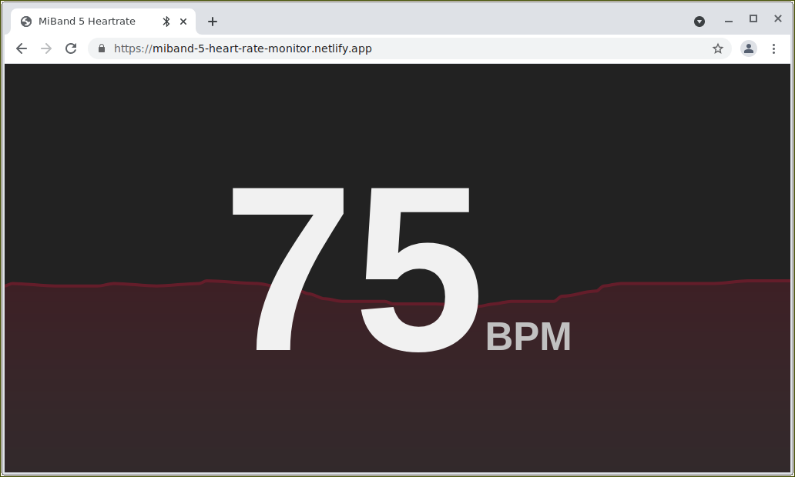

[Live demo](https://miband-5-heart-rate-monitor.netlify.app/)

# Mi Band 4/5 Heart Rate Monitor

Display your Mi Band's heart rate in the browser.

## How to use

1. You need a browser with web bluetooth support.
2. You need to obtain an auth key for your Mi
   Band (https://github.com/Freeyourgadget/Gadgetbridge/wiki/Huami-Server-Pairing)
3. Try it out at [https://miband-5-heart-rate-monitor.netlify.app/](https://miband-5-heart-rate-monitor.netlify.app/)

## Inspiration

- [satcar77/miband4](https://github.com/satcar77/miband4)
- [vshymanskyy/miband-js](https://github.com/vshymanskyy/miband-js)
- [VladKolerts/miband4](https://github.com/VladKolerts/miband4)
